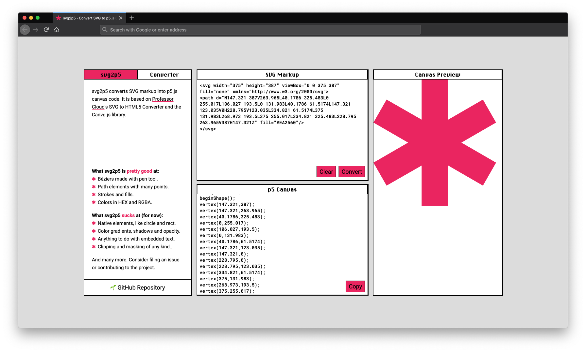

  

<h2 align="center">
  svg2p5
</h2>
<h1 align="center">
  Convert SVG markup to p5.js canvas
</h1>

svg2p5 is a converter that takes in SVG markup in the form of a `<svg>` tag or a `<path>` tag and outputs equivalent [p5.js](https://p5js.org/) canvas code. 

### Support
|✅ Supported SVG Markup  | ❌ Unsupported SVG Markup (yet)   |
|---|---|
| `<path>`  | `<circle>`  |
| `stroke=""`  | `<rect>`  |
| `fill=""`  | `<linearGradient>`  |
| `strokeCap=""`  | `<text>`  |
| `strokeJoin=""`  | etc. |

### Known Issues
Generally, the output may be imperfect and require some manual cleaning.
- Sometimes the last vertex connects to the first vertex.
- Sometimes you will find lonely `vertex()`s and `bezierVertex()`s that you will need to wrap with `beginShape()` and `endShape()` in order to see.

### Short-Term To-Do List
Estimated completion time: end of April 2021.
- [ ] Error prevention through linting SVG markup for unsupported attributes, notifying user and disabling conversion if that is the case.
- [ ] MacOS Classic System 3 style active states for windows.
- [ ] Update canvg.js to current version instead of using the ancient one that came with Professor Cloud.

### Long-Term Objective
Make svg2p5 support [all SVG attributes](https://developer.mozilla.org/en-US/docs/Web/SVG/Attribute) that have p5.js equivalents. That includes, shadows, text, gradients, native shapes, etc.

### Credits
- **Algorithm** Based on [Professor Cloud](https://www.professorcloud.com/svg-to-canvas/) SVG to HTML5 converter, which in turn uses [canvg.js](https://github.com/canvg/canvg)!
- **Interface** MacOS Classic System 3.
- **Colophon** [Chicago](https://fontsarena.com/chicago-flf-by-susan-kare-robin-casady/) by Susan Kare, [Roboto](https://fonts.google.com/specimen/Roboto) and [Roboto Mono](https://fonts.google.com/specimen/Roboto+Mono) by Christian Robertson
- **I 💖 [P5.JS](https://p5js.org/)**
